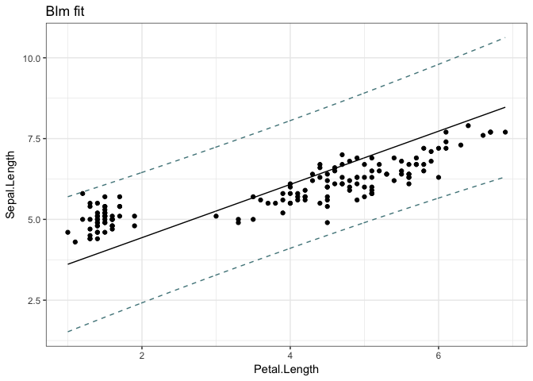

Bayesian linear regression
================
Marni Tausen
2017-01-15

### blm package

The blm package is an R package for Bayesian linear models, which has the same kind of interface as lm and glm in R. The difference of the Bayesian model, is that we do not directly estimate the value of the parameters, instead we estimate an normal distribution giving the mean and the variance for each of the parameters.

### Installation

The package is currently only available through github. Therefore the easiest way to install the package, is to use the devtools package. Skip the installation part, if already installed.

``` r
install.packages("devtools")
library(devtools)
```

Using devtools, you can install the package using install\_github().

``` r
install_github("MarniTausen/blm")
```

and voila! The package is installed.

### Quick Guide

The blm package uses the same interface as the lm and glm functions in R, and therefore it functions very similarly.

First to load the package:

``` r
library(blm)
```

To construct the blm model use the blm function and feed it a formula, with the structure **response** ~ **predictors**. Here is a simple example using the iris dataset.

``` r
data(iris)

blm(Sepal.Length ~ Petal.Length + Sepal.Width, data=iris)
```

    blm model: Sepal.Length ~ Petal.Length + Sepal.Width

    Posterior:
         (Intercept) Petal.Length Sepal.Width
    [1,]    1.531317    0.5035944   0.7880398

                 (Intercept) Petal.Length  Sepal.Width
    (Intercept)   0.34708601 -0.015141624 -0.093490305
    Petal.Length -0.01514162  0.002259808  0.002207875
    Sepal.Width  -0.09349030  0.002207875  0.028069029

To extract summary statistics of the blm model, we can use the summary function on the blm model.

``` r
summary(blm(Sepal.Length ~ Petal.Length + Sepal.Width, data=iris))
```

    blm model: Sepal.Length ~ Petal.Length + Sepal.Width

    Coefficients:
                      Mean    Variance p-value     
    (Intercept)  1.5313165 0.347086008  <0.001  ***
    Petal.Length 0.5035944 0.002259808 <0.0001 ****
    Sepal.Width  0.7880398 0.028069029 <0.0001 ****
    ------ 
    Signif. codes:  0 '****' 0.0001 '***' 0.001 '**' 0.01 '*' 0.05 '.' 0.1 ' ' 1

    Confindence intervals: 
                     2.5 %   97.5 %
    (Intercept)  0.3766232 2.686010
    Petal.Length 0.4104227 0.596766
    Sepal.Width  0.4596711 1.116409

    R-squared: 0.83106

Its also possible to plot the blm model, and see the regression. Note: the confidence intervals and regression might not always be accurate, especially with multiple predictors.

``` r
plot(blm(Sepal.Length ~ Petal.Length + Sepal.Width, data=iris))
```



### Features

A list of features the package contains, and a short description of their purpose and function. For a more indepth description check the documentation with ?x, either for function, or follow the description of the generic documentation.

-   blm
    -   The core function of the package. Produces the Bayesian linear model (blm) and the blm object. It takes in the parameters: blm(model, alpha=1, beta=1, prior=NULL, ...), where ... includes the parameter data, which allows the inclusion of a data.frame for the data in the formula. For an indepth look at the function of alpha and beta, look at the next section. The prior parameter allows the user to specific more specially what the prior is.
-   coef (coefficients)
    -   coef, gives the coefficients of the model when used on a blm class object. This returns a vector with the names of the coefficients.
-   confint
    -   confint gives the confidence intervals of the coefficients from the blm object. The usage is as following: confint(object, parm, level = 0.95, ...). Where object is the blm object, and parm is a vector specifying which coefficients should be considered. Level refers to the confidence level, where 0.95 corresponds to the 95% confidence level.
-   deviance
    -   deviance returns the deviance of the blm object.
-   fitted
    -   fitted gives the fitted response values in the blm object.
-   predict
    -   predict allows the prediction of new response variables from new observations. If no new data is provided it returns the fitted response variables.
-   residuals
    -   returns the residuals of blm object, which is the difference between the fitted response values and the observed response values.
-   summary
    -   summary, produces and returns an summary.blm object, which contains summary statistics of the blm object. Printing this object displays the summary statistics.

There are two objects/classes included in the package, which contain a lot of attributes. Here is a summary of attributes in the two objects.

-   blm
    -   **coefficients**: *vector of the coefficients*
    -   **variances**: *covariance matrix of the parameters*
    -   **model**: *the observations used for the model*
    -   **prior**: *the prior used for the creation of the posterior*
    -   **posterior**: *the posterior, containing the means and covariances of the parameters*
    -   **terms**: *the formula used for the model*
    -   **alpha**: *the alpha parameter used for the prior*
    -   **beta**: *the beta parameter used for the posterior*
-   summary.blm
    -   **terms**: *the formula used for the blm model*
    -   **confint**: *the confidence intervals of the coefficients*
    -   **coefficients**: *coefficients stats, mean, variance*
    -   **Rsquared**: *R-squared statistics of the fit*

Finally there are two internal functions used for the actual Bayesian linear calculations. A description of how these functions work, and how parameters alpha and beta influence the results, is explained in the next section.

-   make\_prior
    -   Initialize the prior distribution. Usage is as follows: make\_prior(model, alpha, ...), where model is the formula, and alpha is the hyper-parameter. It returns a prior distribution, with a vector of means and a covariance matrix.
-   update\_prior
    -   Updates a prior distribution, with the observed data and produces a posterior distribution. Usage is as follows: update\_prior(model, prior, beta, ...), where model is the formula, prior is the prior distribution, and beta is a hyper-parameter. It returns a posterior distribution, with a vector of means and a covariance matrix.

### Bayesian properties

In The Bayesian model we do not directly estimate the value of the parameters, instead we estimate an normal distribution giving the mean and the variance for each of the parameters.

In linear regression we describe the model as: *y* = *w*<sub>0</sub> + *w*<sub>1</sub>*x* + *ϵ* where *ϵ* ∼ *N*(0, *σ*<sup>2</sup>). Where as in Bayesian regression we describe it as a normal distribution: *y* ∼ *N*(*w*<sub>0</sub> + *w*<sub>1</sub>*x*, 1/*β*), where *β* is known as the precision, and is a hyper-parameter.

With an Bayesian approach we can include or assume a prior distribution, if we have some prior knowledge regarding the data. For this model the default prior distribution is *p*(*w*|*α*)=*N*(0, *α*<sup>−1</sup>*I*), where *α* is the precision parameter regarding the prior knowledge.

When presented with a set of observations for x and y, *x*<sup>*T*</sup> = (*x*<sub>1</sub>, *x*<sub>2</sub>, …, *x*<sub>*n*</sub>) and *y*<sup>*T*</sup> = (*y*<sub>1</sub>, *y*<sub>2</sub>, …, *y*<sub>*n*</sub>), we want to update the prior and estimate what the weights/coefficients of the model are. Then we get the posterior distribution for the weights *p*(*w*|*x*, *y*, *α*, *β*)=*N*(*m*<sub>*x*, *y*</sub>, *S*<sub>*x*, *y*</sub>).

To calculate the weights, which corresponds to *m*<sub>*x*, *y*</sub>, can be done using the equation: *m*<sub>*x*, *y*</sub> = *β* \* *S*<sub>*x*, *y*</sub> \* *ϕ*<sub>*x*</sub><sup>*T*</sup> \* *y*, where *ϕ*<sub>*x*</sub> is a model matrix the containing observations. It is structured such that for any observation i, it contains 1 and *x*<sub>*i*</sub>, for the intercept and the slope.

To calculate the covariance, *S*<sub>*x*, *y*</sub> we have: *S*<sub>*x*, *y*</sub><sup>−1</sup> = *α*<sup>−1</sup>*I* + *β* \* *ϕ*<sub>*x*</sub><sup>*T*</sup> \* *ϕ*<sub>*x*</sub>, where *α*<sup>−1</sup>*I* corresponds to the prior distribution. The calculation is the inverse of the covariance matrix, and therefore inverting it gives us *S*<sub>*x*, *y*</sub>, however it is easier to calculate as the inverse.

In the package the functions, which do these calculates are make\_prior and update\_prior. make\_prior initializes the prior *N*(0, *α*<sup>−1</sup>*I*) for a given *α* value. update\_prior uses the prior to calculate the posterior distribution *N*(*m*<sub>*x*, *y*</sub>, *S*<sub>*x*, *y*</sub>). In both of these we have two hyper-parameters, alpha (*α*) and beta (*β*), which relate to the precision of the measurements. Alpha decides the prior distribution, and beta affects the inclusion of new data.

These parameters are important for small sample sizes, where they have an large effect. With the introduction of more data, their effect decreases.
